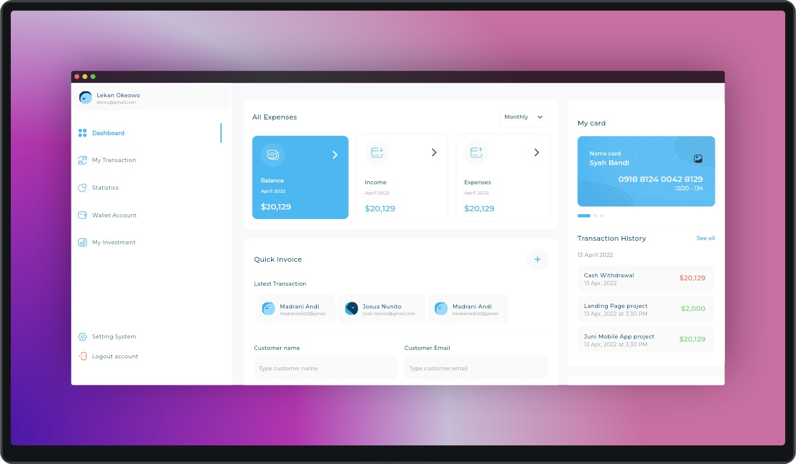
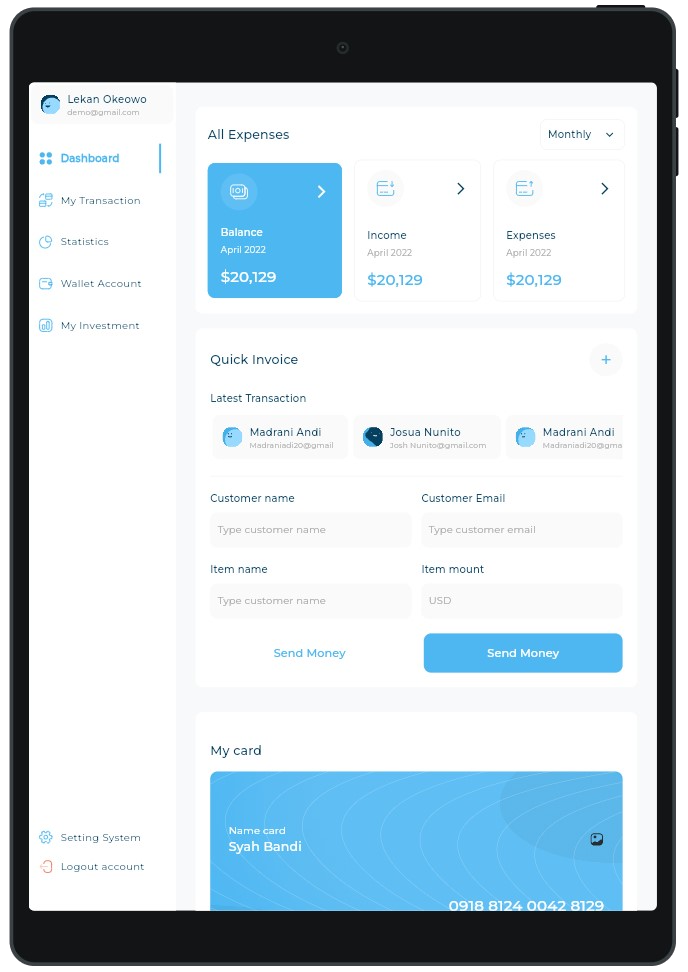
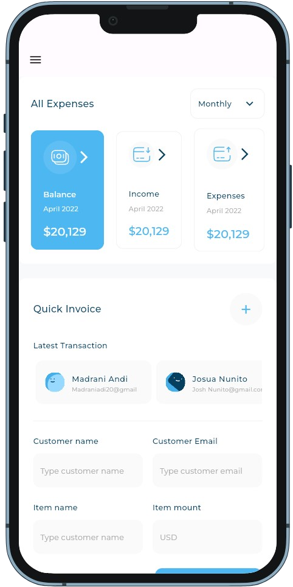

# Responsive Dashboard

## Mastering Flutter: Responsive & Adaptive UI Design
Welcome to the project repository for "Mastering Flutter: Responsive & Adaptive UI Design"! This project is aimed at applying the concepts and techniques learned throughout the course to create a real-world Flutter application with responsive and adaptive user interfaces.


## Project Overview
In this project, we will be building a Flutter application from scratch, focusing on creating UI components that seamlessly adapt to different screen sizes and orientations. The project will incorporate the following key aspects:

* <b>Responsive Design:</b> Ensuring that our application's layout adjusts dynamically to various screen sizes, providing an optimal viewing experience across devices.

* <b>Adaptive Design:</b> Implementing platform-specific design elements to maintain consistency and familiarity for users on both iOS and Android platforms.

* <b>Cross-Platform Compatibility:</b> Testing and optimizing the application to ensure smooth performance on different devices and platforms.

## Getting Started
run command
```
flutter pub get
flutter run 
```

## Screenshot

### Desktop

 

### Tablet


### mobile
 
<br>

## Sources
  * [Mastering Flutter: Responsive & Adaptive UI Design](https://www.udemy.com/course/mastering-flutter-responsive-adaptive-ui-design-arabic/)